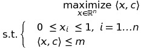
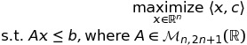

# metaheuristics

My own work for the Metaheuristics course consisted on implementing the following algorithms:
* Brute Force Algorithm
* Simulated Annealing (SA)
* Simplex method
* Genetic Annealing (GA)
* Particle swarm optimization (PSO)

These algorithms have been tested on toy examples. 

Although some have been tried in the context of <strong>Google Challenge</strong>. More details on this competition below.

## Brute Force Algorithm on Integer Linear Programming (ILP) problem

We solved the following ILP problem using a very naive method since we did an exhaustive search over basic feasible solutions of this ILP. Basic feasible solutions are a subset of vertices of constraint polytope, here an hypercube of dimension d with 2^d vertices. we generate vertices on the fly as binary arrays and evaluate them.

## Simulated Annealing applied to non-convex optimization problem

We used SA to maximize the following fitness function:

with a fast update using uniform sampling and the following cooling schedule:

## Simplex Method applied to Linear Programming (LP)

We applied Revisited Simplex Method to the following LP problem in dimension 50.

## Genetic Algorithm applied to Traveling Salesman Problem

We applied GA to solve TSP on a sample of 9 random points. We computed euclidian distances between them as cost for edges. We used a population of 8 individuals, a proba of mutation of 0.15. We show the loop corresponding to the worst solution at each generation and added the associated cost in terms of distance. The number of mutations at each generation is also indicated.

## Particle Swarm Optimization algorithm applied to Rosenbrock minimization

We used PSO in order to solve the following optimization problem:

## Google Challenge

Original optimization problem:

Relaxed optimization problem: 

We get a LP optimization problem: 

